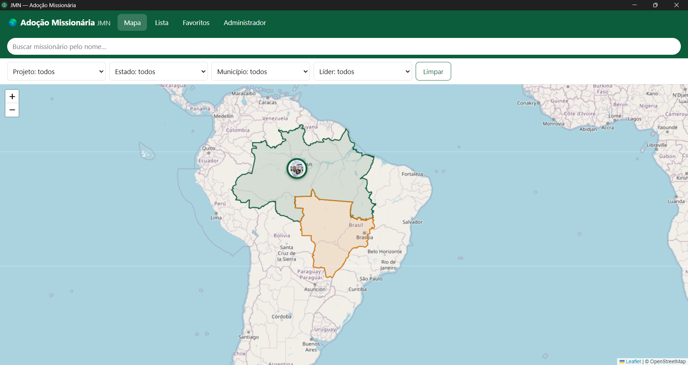
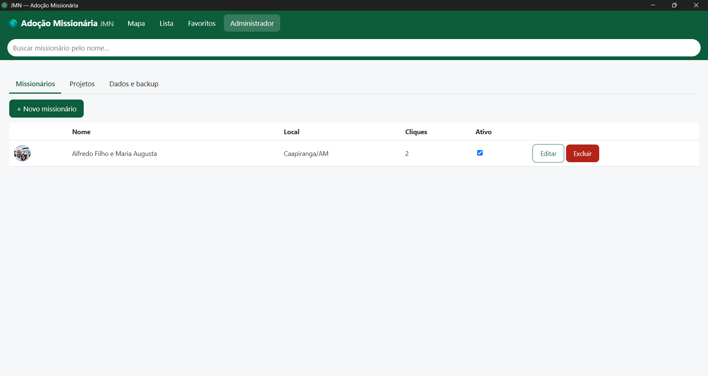
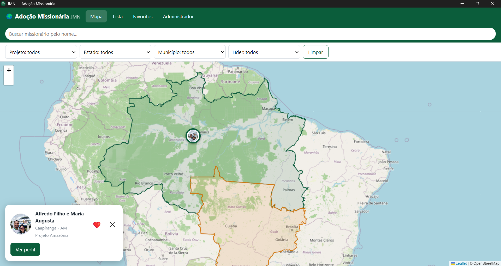

# JMN — Adoção Missionária

Desktop application developed as a personal technology project to organize missionary information and support missionary-related activities.

## About the Project

JMN — Adoção Missionária is a Windows desktop application designed to organize missionary profiles, projects and geographic information.

The project was developed as part of my practical learning while studying Systems Analysis and Development.

## Main Features

- Missionary profile management
- Missionary project management
- Geographic information and coordinates
- Interactive map
- Offline map resources
- Administrative access control
- Favorites
- Event tracking
- Data backup and restoration
- Data import and export
- Image and gallery management

## Technologies

- JavaScript
- Electron
- Node.js
- Leaflet
- Leaflet MarkerCluster
- HTML
- CSS

## Technical Highlights

The application uses Electron's main process, renderer process and preload layer to separate application responsibilities.

It uses IPC communication between the application processes and local data storage for application information.

The project also includes administrative authentication, data validation, backup and restoration features, and support for offline map resources.

## My Role

This is a personal project developed as part of my practical learning while studying Systems Analysis and Development.

I worked on the application structure, implementation of features, data management, testing, debugging and Windows desktop configuration.

## Project Status

Personal project under continuous development and improvement.

## Screenshots

### Map and Missionary Profile

Interactive map interface with search, filters and missionary profile information.

### Administrative Panel

Administrative interface for managing missionary records.

### Geographic Overview

Geographic visualization of missionary locations and project areas.

## Author

Lucas dos Anjos

Systems Analysis and Development Student seeking my first professional opportunity in Information Technology.
